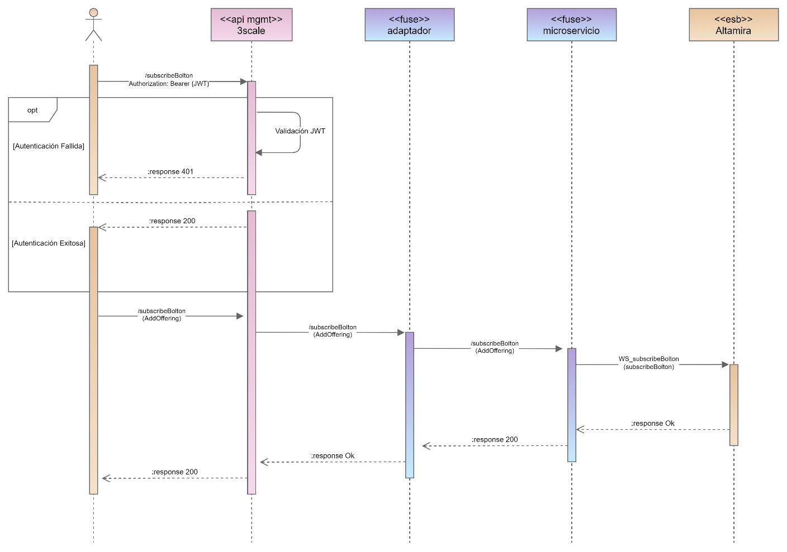

# Diseño Funcional Operación [Nombre]

## 1. Descripción

[Descripción de la operación]

[Volver al Índice](#índice)

---

## 2. Diagrama de Secuencia

A continuación, se relaciona el diagrama de secuencia objeto de este diseño.



[Volver al Índice](#índice)

---

## 3. Características

| Característica | Descripción |
| -------------- | ----------- |
| **Iniciador** | Consumidor interno/externo |
| **Método de transferencia** | REST |
| **Sintaxis** | JSON |
| **Método HTTP** | GET |
| **Path externo** | ***/[nivel 1 eTOM)]/[telefonica]/[version]/[nombre_microservicio]/[nombre_operación][parametros]***<br> /resource/telefonica/v1/available-ports-info-b2b?Mnemonic=string&Rack=string&Subrack=string |
| **Path interno** | ***/[telefonica]/[version]/[nombre_microservicio]/[nombre_operación][parametros]***<br> /telefonica/v1/available-ports-info-b2b?Mnemonic=string&Rack=string&Subrack=string |

[Volver al Índice](#índice)

---

## 4. Estructura del Mensaje

### Definición de Campos

  <body>
<style>
@page { margin-left: 0.7in; margin-right: 0.7in; margin-top: 0.75in; margin-bottom: 0.75in; }
body { margin-left: 0.7in; margin-right: 0.7in; margin-top: 0.75in; margin-bottom: 0.75in; }
</style>
    <table border="0" cellpadding="0" cellspacing="0" id="sheet0" class="sheet0 gridlines">
        <col class="col0">
        <col class="col1">
        <col class="col2">
        <col class="col3">
        <col class="col4">
        <col class="col5">
        <col class="col6">
        <tbody>
          <tr class="row0">
            <td class="column0 style10 s style10" colspan="2">Access</td>
            <td class="column2 style8 s style9" rowspan="2">Field Name</td>
            <td class="column3 style8 s style9" rowspan="2">Child Fields</td>
            <td class="column4 style8 s style9" rowspan="2">Description</td>
            <td class="column5 style8 s style9" rowspan="2">Type</td>
            <td class="column6 style8 s style9" rowspan="2">Required?</td>
          </tr>
          <tr class="row1">
            <td class="column0 style1 s">(I/O)</td>
            <td class="column1 style1 s">Type</td>
          </tr>
          <tr class="row2">
            <td class="column0 style2 s">I</td>
            <td class="column1 style15 s">[Query Parameters / Path Parameters]</td>
            <td class="column2 style3 s">Texto</td>
            <td class="column3 style3 s">NA</td>
            <td class="column4 style5 s">Texto</td>
            <td class="column5 style4 s">Tipo dato</td>
            <td class="column6 style6 s">[Y/N]</td>
          </tr>
          <tr class="row3">
            <td class="column0 style2 s">O</td>
            <td class="column1 style15 s">Body</td>
            <td class="column2 style3 s">Texto</td>
            <td class="column3 style3 s">NA</td>
            <td class="column4 style3 s">Texto</td>
            <td class="column5 style4 s">Tipo dato</td>
            <td class="column6 style7 s">[Y/N]</td>
          </tr>
          <tr class="row4">
            <td class="column0 style13 s style14" rowspan="2">O</td>
            <td class="column1 style16 s style17" rowspan="2">Body</td>
            <td class="column2 style11 s style12" rowspan="2">Texto</td>
            <td class="column3 style3 s">Texto</td>
            <td class="column4 style3 s">Texto</td>
            <td class="column5 style4 s">Tipo dato</td>
            <td class="column6 style7 s">[Y/N]</td>
          </tr>
          <tr class="row5">
            <td class="column3 style3 s">Texto</td>
            <td class="column4 style3 s">Texto</td>
            <td class="column5 style4 s">Tipo dato</td>
            <td class="column6 style7 s">[Y/N]</td>
          </tr>
        </tbody>
    </table>
  </body>

### Definición de Grupos

<body>
<style>
@page { margin-left: 0.7in; margin-right: 0.7in; margin-top: 0.75in; margin-bottom: 0.75in; }
body { margin-left: 0.7in; margin-right: 0.7in; margin-top: 0.75in; margin-bottom: 0.75in; }
</style>
    <table border="0" cellpadding="0" cellspacing="0" id="sheet0" class="sheet0 gridlines">
        <col class="col0">
        <col class="col1">
        <col class="col2">
        <tbody>
          <tr class="row0">
            <td class="column0 style4 s style4">Field Name</td>
            <td class="column1 style4 s style4">Description</td>
            <td class="column2 style4 s style4">Required?</td>
          </tr>
          <tr class="row2">
            <td class="column0 style1 s">Texto</td>
            <td class="column1 style2 s">Texto</td>
            <td class="column2 style3 s">[Y/N]</td>
          </tr>
          <tr class="row3">
            <td class="column0 style1 s">Texto</td>
            <td class="column1 style2 s">Texto</td>
            <td class="column2 style3 s">[Y/N]</td>
          </tr>
        </tbody>
    </table>
  </body>

[Volver al Índice](#índice)

---

## 5. Ejemplos Mensajes

Request \[URL/body]

```json
{
    
}

```

Response body

```json
{
    
}
```

[Volver al Índice](#índice)

---

## Diseño Técnico Operación [Nombre]

## Orquestación de Servicios

Esta sección no aplica para esta interfaz.

[Volver al Índice](#índice)

---

## Integración de Servicios

### 1. Características Proveedor

| Característica | Descripción |
| -------------- | ----------- |
| **Sistema**    | [backend] |
| **Método de transferencia** |             |
| **Sintaxis** |         |
| **Método HTTP** |      |
| **Servicio** |             |

[Volver al Índice](#índice)

---

### 2. Mapeo de Campos

Input Mappings

| MPI | MPI | Operation | Type | Formula
| -------- | -------- | -------- |-------- | -------- |
| Text     | Text     | Text     |Text     | Text     |

Output Mappings

| MPI | MPI | Operation | Type | Formula
| -------- | -------- | -------- |-------- | -------- |
| Text     | Text     | Text     |Text     | Text     |

[Volver al Índice](#índice)

---

### 3. Especificación Mapeo de Valores

Esta sección no aplica para esta interfaz.

[Volver al Índice](#índice)

---

### 4. Mapeo de Errores

Cuando ocurre un error en el servicio se debe realizar el mapeo de acuerdo con la sección 2. Mapeo de Campos y el estándar del documento de errores.

[Volver al Índice](#índice)
